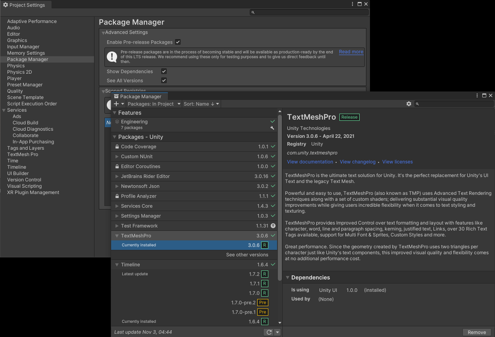

# FixPackageManagerSeeAllVersions
Allows viewing the button `See All Versions` in the Package Manager, which was hidden after Unity 2021 by design.

This is needed because updating packages sometimes introduces new bugs, requiring to go back to a previous version. Without this button, such task must be done manually by editing the `Packages/manifest.json` file.

# How to use
Drag and drop the folder `FixPackageManagerSeeAllVersions` anywhere in the Assets folder of your Unity project.

Open the package manager, click on the cog button next to the search toolbar, click `Advanced Project Settings` and toggle on `See All Versions`

# How it works

The button is only shown if the setting `See All Versions` is true. This setting is hidden and set to false if `Unsupported.IsDeveloperBuild()` returns false.
Using Harmony that method is patched so that it returns always true instead of going inside Unity and ultimately return false. That means this solution can lead to side effects, but was the simplest one and I expect such side effects to not be problematic. Hopefully.

Harmony patches the method after opening Unity or recompiling code and should takes less than a second.

# Other

It makes use of https://github.com/pardeike/Harmony to patch Unity.

If you are already using Harmony for something else, make sure only one copy of the 0harmony.dll exists. Just remove all but one of them and that should be enough.
